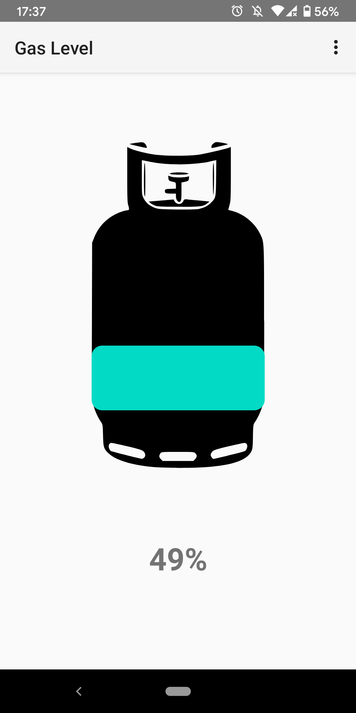
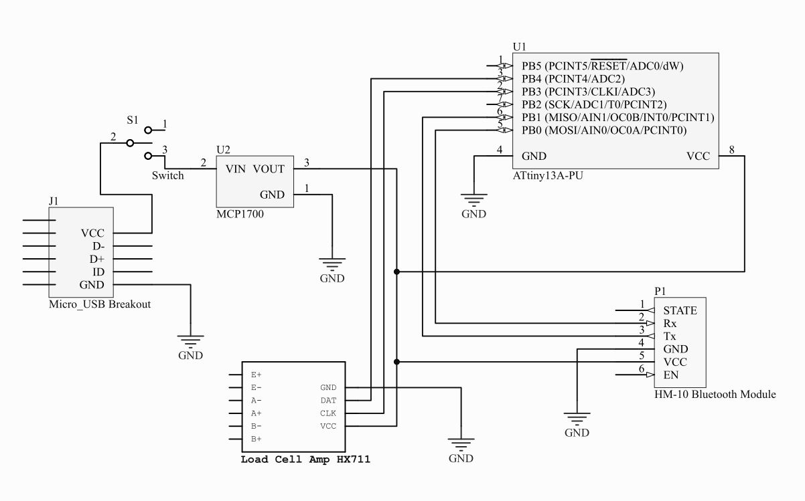

# GasWaage
GasWaage is a project that shows the level of a gas cylinder located in a hard-to-reach place. This project consists of two parts, the scale which sends the weight of the gas bottle to the mobile phone via bluetooth low energy and the Android application itself. The main components of the scale consist of an Attiny13A, HM-10 Bluetooth module and an HX711 Load Cell Amplifier.

  

## Schematics

  

## Config the HM-10 Module

>AT+PWRM1

OK+Set:1

>AT+NAMEGasWaage

OK+Set:GasWaage

## Part List
1. Attiny13A & DIP 8 Socket
2. HM-10 Bluetooth Modul
3. HX711 ADC & (4x) 50KG Weight Cell
4. 3.3V Voltage Regulator (MCP 1700)
5. 3D Printed Parts
6. Mico-USB breakout board (Or other Power supply adapter)
7. Toggle Switch
8. 4cm x 6xcm perfboard
9. PIN Header (Male & Female)
10. jumper cable

## Todo
1. Improve the App
2. Replace the HM-10 with something better
3. improve 3d printed parts
4. Pull all PINS that atre not used to Ground / VCC 

